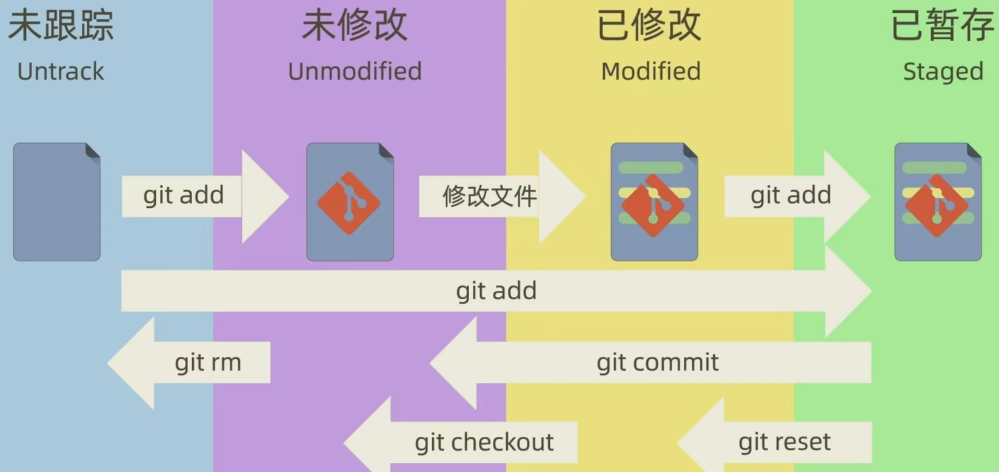

# Git 学习笔记 📝

## 一、Git 基础配置与初始化
### 1. 版本检查
```bash
git -v  # 查看 Git 版本，示例输出：git version 2.40.0
```

### 2. 全局配置（首次使用必做）
```bash
# 配置用户名
git config --global user.name "Jasper Yang"
# 配置邮箱
git config --global user.email geekhall.cn@gmail.com
# 配置凭证存储（避免每次推送输入密码）
git config --global credential.helper store
```

### 3. 创建仓库
```bash
# 克隆远程仓库到本地
git clone <url>
```

---

## 二、Git 核心概念
### 1. 四个区域
- **工作区（Working Directory）**：本地电脑上能直接看到和修改的文件目录。
- **暂存区（Stage/Index）**：位于 `.git` 目录下，临时存放待提交的修改。
- **本地仓库（Repository）**：`.git` 目录，存储所有版本历史和元数据。
- **远程仓库（Remote）**：托管在服务器上的仓库（如 GitHub、Gitee）。

### 2. 文件状态流转


---

## 三、常用基础命令
### 1. 查看仓库状态
```bash
git status  # 查看当前工作区和暂存区的状态
```

### 2. 添加到暂存区
```bash
git add <file>       # 添加单个文件到暂存区
git add *.txt        # 使用通配符添加指定类型文件
```

### 3. 提交到本地仓库
```bash
git commit -am "message" # 跳过暂存区，直接提交所有已跟踪文件的修改
```

### 4. 查看提交历史
```bash
git log              # 查看完整提交历史
git log --oneline    # 查看简洁的单行提交历史
git ls-files         # 查看暂存区中的文件列表
```

### 5.HEAD 指针介绍
- **HEAD** 是一个指向当前所在分支最新提交的指针。
- 每次提交后，HEAD 会自动移动到新的提交。
- 可以使用 `git log --oneline` 查看提交历史，HEAD 所在的提交会被标记为 `*`。  
  
假设提交历史为：
```
commit 1 (HEAD -> master)
commit 2
commit 3
```
| 命令 | 作用 |
|------|------|
| `HEAD~n` | 表示上n个提交 |
| `HEAD^ 或 HEAD~` | 表示倒数第1个提交(对应上图commit 2) |

---

## 四、文件删除
| 命令 | 作用 |
|------|------|
| `rm file; git add file` | 先从工作区删除文件，再将删除操作暂存 |
| `git rm <file>` | 同时从工作区和暂存区删除文件 |
| `git rm --cached <file>` | 仅从暂存区删除文件，保留工作区副本 |
| `git rm -r *` | 递归删除目录下所有子目录和文件 |

> ⚠️ 注意：删除操作后需要执行 `git commit` 才能将变更永久保存到仓库。

---

## 五、差异比较（git diff）
| 命令 | 比较范围 |
|------|----------|
| `git diff` | 工作区 vs 暂存区 |
| `git diff HEAD` | 工作区 + 暂存区 vs 本地仓库最新提交 |
| `git diff --cached` / `git diff --staged` | 暂存区 vs 本地仓库最新提交 |
| `git diff <commit1> <commit2>` | 比较两个提交之间的差异 |
| `git diff <branch1> <branch2>` | 比较两个分支之间的差异 |

---

## 六、版本回退与撤销
### 1. git reset（重置 HEAD）
- `--soft`：仅重置 HEAD，保留暂存区和工作区修改。
- `--mixed`（默认）：重置 HEAD 和暂存区，保留工作区修改。
- `--hard`：重置 HEAD、暂存区和工作区（**谨慎使用，会丢失未提交修改**）。

### 2. 找回丢失的提交
```bash
git reflog  # 查看所有操作记录（包括已删除的提交）
git reset --hard <commit-hash>  # 回退到指定提交
```

### 3. 其他撤销操作
```bash
git checkout <file>          # 恢复文件到上一次提交（覆盖工作区）
git restore --staged <file>  # 撤销暂存（git add 的反向操作）
```

---

## 七、.gitignore 忽略文件
通过 `.gitignore` 文件指定 Git 忽略的文件/目录，避免将无关文件（如日志、缓存、编译产物）提交到仓库。

### 常用规则示例
```bash
# 忽略所有 .a 文件
*.a

# 例外：跟踪 lib.a（即使前面忽略了 .a 文件）
!lib.a

# 仅忽略当前目录的 TODO 文件，不忽略子目录的 TODO
/TODO

# 忽略所有名为 build 的目录，注意要加上斜杠 '/'
build/

# 忽略 doc/ 目录下的 .txt 文件，但不忽略 doc/server/arch.txt
doc/*.txt

# 忽略 doc/ 目录及其所有子目录下的 .pdf 文件
doc/**/*.pdf
```

---

## 八、分支操作
### 1. 分支管理
```bash
git branch                  # 查看本地分支（当前分支前有 *）
git branch -r               # 查看远程分支
git branch <branch-name>    # 创建新分支
git checkout <branch-name>  # 切换到指定分支
git checkout -b <branch-name> # 创建并切换到新分支
git branch -d <branch-name> # 删除已合并的分支
git branch -D <branch-name> # 强制删除未合并的分支
git tag <tag-name>          # 为当前提交打标签（用于版本发布）
```

### 2. 分支合并与 Rebase
```bash
# 合并分支到当前分支
git merge <branch-name>
git merge --no-ff -m "message" <branch-name>  # 强制创建合并提交，保留分支历史
git merge --squash <branch-name>              # 将分支所有提交压缩为一个提交后合并

# Rebase（使提交历史更线性，多人协作时避免对已推送的分支使用）
git rebase <branch-name>
```

---

## 九、Stash 暂存工作区
当需要切换分支但当前工作区有未完成修改时，可使用 Stash 临时保存修改。

```bash
git stash save "message"   # 暂存当前工作区和暂存区的修改
git stash list             # 查看所有暂存记录
git stash pop              # 恢复最近一次暂存并删除该记录
git stash apply            # 恢复最近一次暂存但不删除记录
git stash drop stash@{2}   # 删除指定的暂存记录
git stash clear            # 删除所有暂存记录
```

---

## 十、远程仓库操作
### 1. ssh 密钥配置(github为例)
```bash
# 切换到~/.ssh 目录
cd ~/.ssh

# 生成新的 ssh 密钥对（默认文件名：id_rsa 和 id_rsa.pub）
ssh-keygen -t rsa -b 4096
# 终端提示：Enter file in which to save the key (/home/qiyucrow/.ssh/id_rsa)
# 直接回车确认默认路径，或输入自定义路径（如 github_ssh）

cat ~/.ssh/github_ssh.pub # 密钥对名字
# 复制公钥内容（将其添加到 GitHub 账户）

gedit config # 编辑 config 文件，添加以下内容
# Host github.com
# 	HostName github.com
# 	PreferredAuthentications publickey
# 	IdentityFile ~/.ssh/github_ssh
```

### 2. 远程仓库管理
```bash
# 可以在拉取仓库界面点击code，选择ssh，复制远程仓库url

# 添加远程仓库
git remote add <remote-name> <remote-url>

# 查看远程仓库
git remote -v

# 删除/重命名远程仓库
git remote rm <remote-name>
git remote rename <old-name> <new-name>

# 拉取/推送代码
git pull <remote-name> <branch-name>  # 拉取并合并远程代码
git pull --rebase                     # 拉取并以 Rebase 方式合并
git push <remote-name> <branch-name>  # 推送本地代码到远程

# 获取远程分支（不合并）
git fetch <remote-name>
git fetch <remote-name> <branch-name>
```

---

## 十一、Git Flow 工作流（可选）
一种标准化的 Git 分支管理模型，适合团队协作开发：
- **master**：主分支，存放稳定的发布版本。
- **develop**：开发分支，整合所有功能开发。
- **feature/* **：功能分支，从 develop 分出，开发完成后合并回 develop。
- **release/* **：发布分支，从 develop 分出，准备版本发布，完成后合并回 master 和 develop。
- **hotfix/* **：修补分支，从 master 分出，修复线上问题，完成后合并回 master 和 develop。

---
